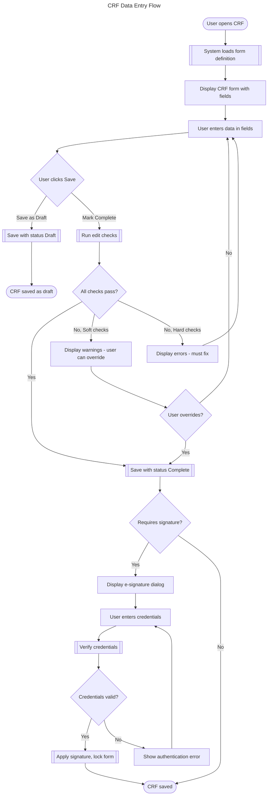

# User Flow Generator

## Purpose

Create comprehensive, visually renderable user flow diagrams from requirements. These diagrams serve as a shared reference between product, design, engineering, and clinical operations teams, ensuring alignment on how users navigate through the system.

## Output Formats

- **Mermaid flowchart syntax**: Renders in Confluence, GitHub, GitLab, Notion, VS Code, and most modern documentation platforms.
- **Narrative description**: Plain-text walkthrough of each path for stakeholders who prefer text.
- **Screen inventory**: List of unique screens/views implied by the flow.

## Workflow

### Step 1: Gather Requirements

**Option A - Jira via Atlassian MCP:**

1. Use `mcp__claude_ai_Atlassian__getJiraIssue` with the story key to retrieve:
   - Summary and description.
   - Acceptance criteria (often in description or a custom field).
   - Linked issues (related stories, epics, sub-tasks).
   - Comments with additional context.
2. If the story references an epic, use `mcp__claude_ai_Atlassian__getJiraIssue` on the epic to get broader context.
3. If multiple related stories exist, use `mcp__claude_ai_Atlassian__searchJiraIssuesUsingJql` to find them:
   ```
   project = TAL AND epic = TAL-123 ORDER BY rank ASC
   ```

**Option B - Direct input:**

1. Accept a workflow name or description from the user.
2. Accept pasted requirements text.

**Option C - Confluence page:**

1. Use `mcp__claude_ai_Atlassian__getConfluencePage` to retrieve workflow documentation.

### Step 2: Identify Flow Elements

Parse the requirements and extract:

- **Actors**: Which user roles participate (CRA, Data Manager, Investigator, Monitor).
- **Entry points**: How the user arrives at this flow (navigation, notification, link).
- **Steps**: Sequential actions the user performs.
- **Decision points**: Conditions that branch the flow (if/else, permissions, data state).
- **System actions**: Backend processing, validations, notifications triggered.
- **Integration touchpoints**: External system calls (CTMS, IRT, safety database).
- **Terminal states**: How the flow ends (success, error, cancel, redirect).
- **Error/exception paths**: What happens when things go wrong.

Present extracted elements to the user for confirmation.

### Step 3: Construct the Mermaid Diagram

Use Mermaid flowchart syntax with these conventions:

**Node shapes:**
- `[Rectangle]` - User action / screen
- `{Diamond}` - Decision point
- `([Stadium])` - Start / end point
- `[[Subroutine]]` - System action / background process
- `[(Database)]` - Data persistence
- `>Flag]` - Notification / alert sent

**Styling:**
```mermaid
%%{init: {'theme': 'base', 'themeVariables': {
  'primaryColor': '#2563EB',
  'primaryTextColor': '#FFFFFF',
  'primaryBorderColor': '#1D4ED8',
  'lineColor': '#6B7280',
  'secondaryColor': '#F3F4F6',
  'tertiaryColor': '#FEF3C7'
}}}%%
```

**Subgraphs for swim lanes:**
```mermaid
subgraph User Actions
  direction TB
  A[Click Submit]
end
subgraph System
  direction TB
  B[[Run Edit Checks]]
end
```

**Link labels for conditions:**
```mermaid
A{Data Valid?} -->|Yes| B[Save Record]
A -->|No| C[Show Errors]
```

### Step 4: Generate the Diagram

Produce a complete Mermaid diagram. Structure it as:

1. **Title comment** with flow name and version.
2. **Theme initialization** block.
3. **Start node** indicating entry point.
4. **Happy path** as the primary left-to-right or top-to-bottom flow.
5. **Error paths** branching off decision points.
6. **System actions** in distinct subgraphs.
7. **End nodes** for all terminal states.

Example structure:



### Step 5: Generate Narrative Description

Accompany each diagram with a plain-text narrative:

```
## CRF Data Entry Flow

### Happy Path
1. User navigates to the CRF from the visit schedule or subject casebook.
2. System loads the form definition and pre-populates any derived fields.
3. User enters data into each field.
4. User clicks "Mark Complete" to finalize the form.
5. System runs all edit checks (range checks, consistency checks, required fields).
6. All checks pass. System saves the CRF with status "Complete".
7. If the form requires an e-signature, the signature dialog is presented.
8. User enters credentials and confirms. System verifies and applies the signature.

### Error Path: Edit Check Failures
4a. User clicks "Mark Complete".
5a. System runs edit checks. Hard check failures are found.
6a. System displays error messages inline next to the offending fields.
7a. User corrects the data and retries.

### Alternative Path: Save as Draft
4b. User clicks "Save as Draft" at any point.
5b. System saves current field values without running edit checks.
6b. CRF status remains "Draft".
```

### Step 6: Generate Screen Inventory

List all unique screens/views implied by the flow:

```
## Screens Identified

| Screen | Purpose | Key Elements |
|--------|---------|-------------|
| CRF Form View | Data entry for a single CRF | Form fields, Save/Complete buttons, field-level indicators |
| Edit Check Results | Display validation results | Error list, warning list, field links |
| E-Signature Dialog | Capture electronic signature | Meaning statement, credential fields, Sign/Cancel buttons |
| Audit Trail Panel | View change history | Timestamp, user, field, old/new values |
```

## Clinical Trial EDC Flow Templates

When the user requests one of these common workflows, use these as starting templates and customize based on specific requirements:

### Patient Enrollment Flow
- Screening consent capture
- Eligibility criteria check (inclusion/exclusion)
- Randomization (if applicable, via IRT integration)
- Subject number assignment
- Site and investigator assignment
- Enrollment confirmation with regulatory timestamps

### CRF Data Entry with Edit Checks
- Form opening and field population
- Real-time field-level validation
- Cross-form consistency checks
- Range checks with configurable thresholds
- Required field enforcement
- Save Draft vs Mark Complete paths
- Query generation for discrepant data

### Query Lifecycle
- Query creation (auto-generated or manual)
- Query notification to site
- Site response with correction or explanation
- Monitor review of response
- Query closure or re-query
- Escalation path for aged queries

### E-Signature Workflow
- Action triggering signature requirement
- Meaning statement presentation
- Credential entry and verification
- Signature application and manifestation
- Audit trail recording
- Failed authentication handling
- Lockout after repeated failures

### Data Export Flow
- Export configuration (datasets, formats, filters)
- Export job submission
- Background processing with progress tracking
- Validation of exported data
- Download or transfer to destination
- Export log and audit trail entry

### Medical Coding Flow
- Verbatim term entry during data collection
- Auto-coding attempt against dictionary (MedDRA, WHODrug)
- Manual coding for unmatched terms
- Coding review and approval
- Code update when dictionary version changes
- Audit trail of coding decisions

### SAE Reporting Flow
- Adverse event entry with severity assessment
- Serious criteria evaluation (triggers SAE workflow)
- SAE form completion with narrative
- Medical review and assessment
- Regulatory reporting timeline calculation
- Submission to safety database
- Follow-up report tracking
- Resolution documentation

## Output Format

Present all outputs in a single, well-structured response:

1. **Flow Summary**: One-paragraph overview.
2. **Mermaid Diagram**: Complete, renderable code block.
3. **Narrative Description**: Numbered walkthrough of each path.
4. **Screen Inventory**: Table of identified screens.
5. **Open Questions**: Any ambiguities in the requirements that need clarification.
6. **Assumptions**: Decisions made where requirements were unclear.

## Quality Checklist

- [ ] Every path through the diagram reaches a terminal node (no dead ends).
- [ ] Decision points have all branches labeled with conditions.
- [ ] System actions are visually distinct from user actions.
- [ ] Error paths are explicitly shown (not just implied).
- [ ] The narrative description matches the diagram exactly.
- [ ] Clinical regulatory requirements are reflected (audit trail, signatures, timestamps).
- [ ] The Mermaid syntax is valid and renders without errors.
- [ ] Actor roles are identified for each action where relevant.
